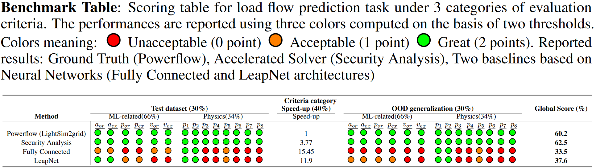

# Evaluation

We propose an homogeneous evaluation of the submitted solutions to predict the load flow in a power grid using the LIPS (Learning Industrial Physical Systems Benchmark suite) platform. The evaluation is performed through 3 categories that cover several aspects of augmented physical simulations namely:

- **ML-related**: standard ML metrics (e.g. MAE, MAPE, etc.) and speed-up with respect to the reference solution computational time;
- **Physical compliance**: respect of underlying physical laws (e.g. local and global energy conservation);
- **Application-based context**: out-of-distribution (OOD) generalization to extrapolate over minimal variations of the problem depending on the application.

In the ideal case, one would expect a solution to perform equally well in all categories but there is no guarantee of that. In particular, even though a solution may perform well in standard machine-learning related evaluation, it is required to assess whether the solution also properly respects the underlying physics.

## Criteria
For each above mentioned category, specific criteria related to the power grid load flow prediction task are defined:

### ML criteria
It should be noted the following metrics are used to evalute the accuracy for the various output variabels:
- MAPE90: the MAPE criteria computed on %10 highest quantile of the distribution (used for currents);
- MAPE10: the MAPE criteria computed on %90 highest quantile of the distribution, allowing to the MAPE criterai explosion due to zero values (used for powers); 
- MAE: mean absolute error (used for voltages). 

### Physics compliance criteria
Various metrics are provided to examine the physics compliance of proposed solutions:

- $P_1$ : Current Positivity: Proportion of negative current $\frac{1}{L}\sum_\ell^L 1_{(\hat{a}^\ell_{or,ex} < 0.)}$
- $P_2$ : Voltage Positivity: Proportion of negative voltages $\frac{1}{L}\sum_\ell^L 1_{(\hat{v}^\ell_{or,ex} < 0.)}$
- $P_3$ :Losses Positivity: Proportion of negative energy losses $\frac{1}{L}\sum_\ell^L 1_{(\hat{p}^\ell_{ex} + \hat{p}^\ell_{or} < 0.)}$
- $P_4$ :Disconnected lines: Proportion of non-null $a,p$ values for disconnected power lines $\frac{1}{L_{disc}}\sum_{\ell_{disc}}^{L_{disc}} 1_{(\lvert\hat{x}^\ell_{ex}\rvert + \lvert\hat{x}^\ell_{or}\rvert > 0.)}$
- $P_5$ :Energy Loss: energy losses range consistency $\frac{\sum_{\ell=1}^L (\hat{p}^\ell_{ex} + \hat{p}^\ell_{or})}{Gen} \in [0.005,0.04]$
- $P_6$ :Global Conservation: Mean energy losses residual MAPE($(Prod - Load) -  (\sum_{\ell=1}^L (\hat{p}^\ell_{ex} + \hat{p}^\ell_{or}))$)
- $P_7$ :Local Conservation: Mean active power residual at nodes MAPE($(p_k^{prod} - p_k^{load}) - (\sum_{l \in neig(k)} \hat{p}^\ell_k)$)
- $P_8$ :Joule Law: MAPE($\sum_{\ell=1}^L (\hat{p}^\ell_{ex} + \hat{p}^\ell_{or}) - R \times \frac{\sum_{\ell=1}^L (\hat{a}^\ell_{ex} + \hat{a}^\ell_{or})}{2} $)

## Practical computation of score
To evaluate properly the above mentioned evaluation criteria categories, in this competition, two test datasets are provided: 
- **test_dataset**: representing the same distribution as the training dataset (only one disconnected power line);
- **test_ood_dataset**: representing a slightly different distribution from the training set (with two simultaneous disconnected power lines).

The *ML-related* (accuracy measures) and *Physical compliance* criteria are computed separately on these datasets. The *speed-up* is computed only on test dataset as the inference time may remains same throughout the different dataset configurations. 

Hence, the global score is calculated based on a linear combination formula of the above evaluation criteria categories on these datasets:

$$\text{Score} = \alpha_{test}× \text{Score}_{{test}} + \alpha_{ood} × \text{Score}_{{OOD}} + \alpha_{speed-up} × \text{Score}_{speed-up}$$

where $\alpha_{test}$, $\alpha_{ood}$, and $\alpha_{speed-up}$ are the coefficients to calibrate the relative importance related to metrics computed on test, out-of-distribution test dataset and speed-up wrt the physical solver obtained using the test dataset.

We explain in the following how to calculate each of the three sub-scores.

### $Score_{test}$

This sub-score is calculated based on a linear combination of 2 categories, namely: *ML-related* and *Physics compliance*.

$$\text{Score}_{{test}} = \alpha_{ML} × \text{Score}_{{ML}} + \alpha_{Physics} × \text{Score}_{{Physics}}$$

where $\alpha_{ML}$ and $\alpha_{Physics}$ are the coefficients to calibrate the relative importance of ML-related and Physics compliance categories respectively for test dataset.

#### $Score_{ML}$
For each quantity of interest, the ML-related sub-score is calculated based on two thresholds that are calibrated to indicate if the metric evaluated on the given quantity gives unacceptable/acceptable/great result. It corresponds to a score of 0 point / 1 point / 2 points, respectively. Within the sub-cateogry, Let :

- $Nr$, the number of unacceptable results overall (number of red circles) 
- $No$, the number of acceptable results overall (number of orange circles)
- $Ng$, the number of great results overall (number of green circles)

Let also $N$, given by $N = Nr + No + Ng$.The score expression is given by:

$$\text{Score}_{{ML}} = \frac{1}{2N} (2 \times Ng + 1 \times No + 0 \times Nr)$$

A perfect score is obtained if all the given quantities provide great results. Indeed, we would have $N = Ng$ and $Nr = No = 0$ which implies $Score_{ML} = 1$.

#### $Score_{Physics}$
For Physics compliance score $Score_{Physics}$, the score is also calibrated based on 2 thresholds and gives 0/1/2 points, similarly to $Score_{ML}$, depending on the result provided by various considered metrics mentioned earlier.

### $Score_{OOD}$
Exactly the same procedure as above for computation of $Score_{test}$ is used to compute the score on the out-of-distribution dataset using two evaluation categories which are : *ML-related* and *Physics compliance*. Hence, the ood $Score_{OOD}$ is obtained by:

$\text{Score}_{{OOD}} = \alpha_{ML} × \text{Score}_{{ML}} + \alpha_{Physics} × \text{Score}_{{Physics}}$

where $\alpha_{ML}$ and $\alpha_{Physics}$ are the coefficients to calibrate the relative importance of ML-related and Physics compliance categories respectively for out-of-distribution test dataset.

### $Score_{Speed-up}$
For the speed-up criteria, we calibrate the score using a Weibull "stretched exponential" function as follows:

$Score_{Speed} = \min \left(1. - exp((-\frac{x}{a})^b) , 1\right)\quad \text{with}\ \  a = c\times(-\ln 0.9)^{-1/b}\quad \text{and}\quad b=1.7, c=5$

The $Score_{Speed}$ curve has the following shape:

<!-- 

$$Score_{Speed} = \min \left(\frac{a\times SpeedUp^2 + b\times SpeedUp + c + \log{10}(k\times SpeedUp)}{a\times SpeedUpMax^2 + b\times SpeedUpMax + c + \log{10}(k\times SpeedUpMax)}, 1\right)$$

 -->

<!--$log10$ function by using an adequate threshold of maximum speed-up to be reached for the task, meaning-->

<!--

$$Score_{Speed}= \min \left(\frac{\log_{10}(SpeedUp)}{\log_{10}(SpeedUpMax)}, 1\right)$$

-->
where  
• $SpeedUp$ is given by
$Score_{SpeedUp}= \frac{time_{ClassicalSolver}}{time_{Inference}}$

• $SpeedUpMax$ is the maximal speed up allowed for the load flow prediction
• $time_{ClassicalSolver}$, the elapsed time to solve the physical problem using the classical solver  
• $time_{Inference}$, the inference time obtained by the submitted solutions

In particular, there is no advantage in providing a solution whose speed exceeds $SpeedUpMax$, as one would get the same perfect score ($Score_{Speed} = 1$) for a solution such that $SpeedUp = SpeedUpMax$.

Note that, while only the inference time appears explicitly in the score computation, it does not mean the training time
is of no concern to us. In particular, if the training time overcomes a given threshold, the proposed solution will be
rejected. Thus, it would be equivalent to a null global score.

### Practical example

Using the notation introduced in the previous subsection, let us consider the following configuration:

- $\alpha_{\text{test}} = 0.3$  
- $\alpha_{\text{ood}} = 0.3$  
- $\alpha_{\text{speed-up}} = 0.4$  
- $\alpha_{ML} = 0.66$  
- $\alpha_{Physics} = 0.34$  
- $b=1.7, c=5$
<!-- - $\text{SpeedUpMax} = 50$
- $a=0.01, b=0.5, c=0.1, k=9$-->

In order to illustrate even further how the score computation works, we provide in Table 2 examples for the load flow prediction task.

As it is the most straightforward to compute, we start with the global score for the solution obtained with 'Grid2Op', the physical solver used to produce the data. It is the reference physical solver, which implies that the accuracy is perfect but the speed-up is lower than the expctation. For illustration purpose, we use the speedup obtained by security analysis (explained in the begining of [Notebook 5](5_Scoring.ipynb)) which was $3.7$ faster than the Grid2op solver. Therefore, we obtain the following subscores:

- $Score_{test} = 0.66 \times \left(\frac{2 \times 6}{2 \times 6}\right) + 0.34 \times \left(\frac{2 \times 8}{2 \times 8}\right) = 1$

- $Score_{ood} = 0.66 \times \left(\frac{2 \times 6}{2 \times 6}\right) + 0.34 \times \left(\frac{2 \times 8}{2 \times 8}\right) = 1$

- $Score_{speedup} = 1 - exp(-\frac{3.77}{18.78})^{1.7} = 0.06$

<!-- - $Score_{speedup} = \frac{0.01 \times 3.77^2 + 0.5 \times 3.77 + 0.1 + \log_{10}(9\times 3.77)}{0.01 \times 50^2 + 0.5 \times 50 + 0.1 + \log_{10}(9\times 50)}=0.069$-->

Then, by combining them, the global score is $Score_{PhysicsSolver} = 0.3 \times 1 + 0.3 \times 1 + 0.4 \times 0.06 = 0.625$, therefore 62.5%.

The procedure is similar with LeapNet architecture. The associated subscores are:

- $Score_{test} = 0.66 \times \left(\frac{2 \times 2 + 1 \times 2 + 0 \times 2}{2 \times 6}\right) + 0.34 \times \left(\frac{2 \times 2 + 1 \times 1 + 0 \times 5}{2 \times 8}\right) = 0.44$

- $Score_{ood} = 0.66 \times \left(\frac{2 \times 0 + 1 \times 4 + 0 \times 2}{2 \times 6}\right) + 0.34 \times \left(\frac{2 \times 2 + 1 \times 1 + 0 \times 5}{2 \times 8}\right) = 0.33$

- $Score_{speedup} = 1 - exp(-\frac{11.9}{18.78})^{1.7} = 0.36$

<!-- - $Score_{speedup} = \frac{0.01 \times 11.9^2 + 0.5 \times 11.9 + 0.1 + \log_{10}(9\times 11.9)}{0.01 \times 50^2 + 0.5 \times 50 + 0.1 + \log_{10}(9\times 50)}=0.18$-->

Then, by combining them, the global score is $Score_{LeapNet} = 0.3 \times 0.44 + 0.3 \times 0.33 + 0.4 \times 0.36 = 0.376$, therefore 37.6%.

